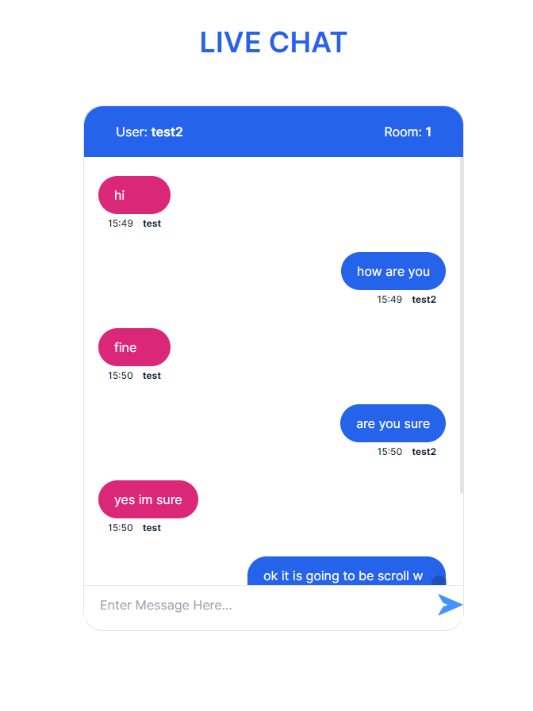

# CHAT APPLICATION

* This app is used to chat between 2 or more people using the same room. 

## KEY TECHNOLOGIES

### FRONT-END
    * React Js
    * Tailwind Css

### BACK-END
    * Node Js
    * Express Js
    * Socket.io

## HOW TO INSTALL

* Clone this app into your computer
* Type `npm install` in your terminal
* To start app type `npm start` in terminal
* App will be start in port 3000
* To build your application type `npm build` in terminal

## SCREENS

### Screen - 1

### Screen - 2
